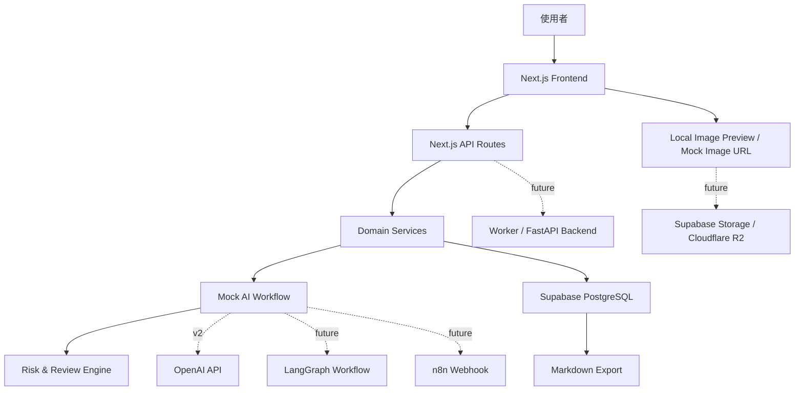
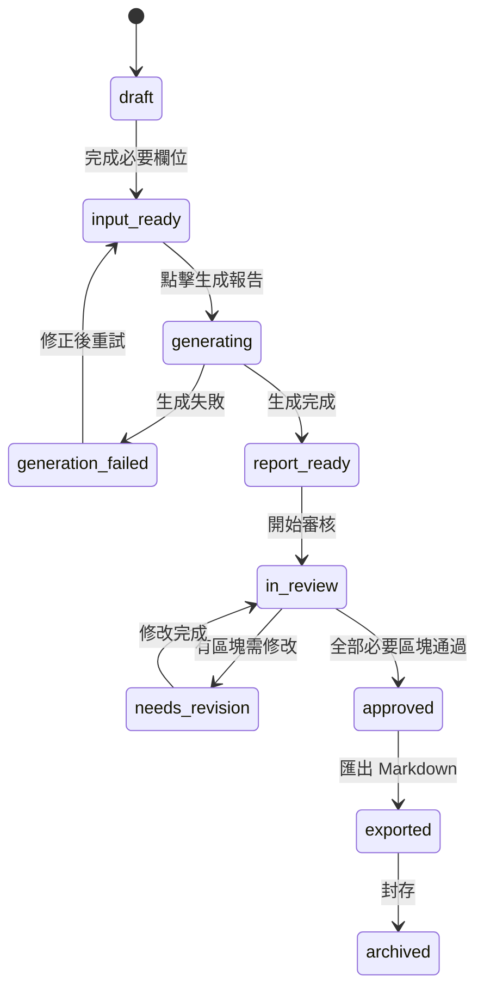

# PAQ Product Launch OS MVP 系統架構

## 1. 系統總覽

PAQ Product Launch OS 的 MVP 是一個以「商品專案」為核心的 AI 商品上市報告系統。第一版不做完整電商平台，也不直接上架、不投廣告、不保證 AI 內容合規或可商用。系統重點是讓使用者輸入商品資料與圖片，透過 mock AI workflow 產出完整商品上市報告，並提供人工審核、修改與 Markdown 匯出。

MVP 建議採用單體 Next.js app，但內部要維持清楚分層，避免未來接 OpenAI API、LangGraph、n8n、Shopify 或其他後端時需要大改。



### MVP 核心模組

- `Web UI`：商品專案列表、商品資料表單、圖片預覽、生成進度、報告檢視、區塊編輯、審核狀態、Markdown 匯出。
- `API Routes`：專案 CRUD、報告生成、報告區塊更新、審核狀態更新、匯出。
- `Domain Services`：封裝商品專案、報告、審核、匯出與 workflow 呼叫，不讓 UI 直接碰資料庫細節。
- `Mock AI Workflow`：第一版用固定模板與輸入資料產生 20 個報告區塊。
- `Risk & Review Engine`：根據商品類別與內容標示食品、美妝、醫療、保健、商標、平台規則、定價等風險。
- `Database`：正式環境使用 Supabase PostgreSQL；本地初期可用 mock JSON，進入資料庫階段後可用 SQLite 或本地 Postgres。

## 2. 前端架構

### 技術選型

- Framework：Next.js
- Language：TypeScript
- Styling：Tailwind CSS
- Component system：shadcn/ui 或自建乾淨可維護的 component system
- Form validation：Zod + React Hook Form
- Server state：可先用原生 fetch；資料互動變多後再加入 TanStack Query

### 前端頁面

1. `ProjectListPage`
   - 顯示商品專案列表。
   - 顯示狀態：草稿、資料已完成、生成中、待審核、已通過、已匯出。
   - 提供建立新專案入口。

2. `ProjectCreatePage`
   - 建立商品專案。
   - 最少欄位：商品名稱、商品類別、主要銷售平台。

3. `ProductInputPage`
   - 商品資料輸入表單。
   - 欄位包含商品功能、成本、預計售價、目標客群、品牌風格、商品規格、注意事項、競品參考。
   - 支援草稿保存。

4. `ImagePreviewPanel`
   - MVP 先做前端 preview 或 mock image URL。
   - 不做圖片上傳正式儲存、不做圖片 AI 分析。

5. `GenerationPage`
   - 顯示 mock workflow 進度。
   - 每個步驟可顯示狀態：等待中、執行中、完成、失敗。

6. `ReportPage`
   - 以 20 個報告區塊呈現完整上市報告。
   - 每個區塊可編輯、可標記審核狀態、可看到風險提示。

7. `ExportPage` 或 `ExportPanel`
   - 產生 Markdown。
   - 顯示匯出前檢查，例如高風險區塊是否仍未審核。

### 前端元件分層

- `components/ui/*`：shadcn/ui 或基礎 UI 元件。
- `components/project/*`：專案列表、專案卡片、專案狀態。
- `components/product/*`：商品表單、圖片預覽、競品輸入。
- `components/report/*`：報告區塊、區塊編輯器、審核控制、風險標籤。
- `components/workflow/*`：生成進度、步驟狀態、錯誤提示。
- `lib/api-client.ts`：前端 API client。
- `lib/schemas/*`：Zod schema，前後端共用。
- `lib/constants/*`：報告區塊類型、商品狀態、風險等級。

### UI 原則

- 第一屏應是可操作的商品專案工作台，不做純行銷 landing page。
- 報告區塊要適合長文閱讀與逐段審核。
- 高風險區塊必須視覺上可辨識，但不要用恐嚇式文字。
- 所有按鈕與狀態文案要清楚，例如「生成報告」、「標記已通過」、「匯出 Markdown」。

## 3. 後端架構

### MVP 後端選型

第一版使用 Next.js API Routes。原因：

- 與 Next.js frontend 同一個專案，開發速度快。
- 對 MVP 的 CRUD、mock workflow、Markdown 匯出足夠。
- 可在 API route 內呼叫 domain service，未來再搬到 FastAPI 或 worker-based backend。

### 建議 API Routes

```text
GET    /api/projects
POST   /api/projects
GET    /api/projects/:projectId
PATCH  /api/projects/:projectId

POST   /api/projects/:projectId/images/mock
GET    /api/projects/:projectId/report
POST   /api/projects/:projectId/generate

PATCH  /api/reports/:reportId/sections/:sectionId
POST   /api/reports/:reportId/export/markdown

GET    /api/workflow-runs/:runId
```

### API response 格式

建議統一 API response，方便前端處理錯誤。

```json
{
  "success": true,
  "data": {},
  "meta": {
    "timestamp": "2026-06-15T00:00:00.000Z"
  }
}
```

錯誤格式：

```json
{
  "success": false,
  "error": {
    "code": "VALIDATION_ERROR",
    "message": "商品名稱為必填欄位",
    "details": {}
  }
}
```

### 後端分層

- `app/api/*`：只處理 HTTP request/response、auth context、input validation。
- `server/services/project-service.ts`：商品專案 CRUD。
- `server/services/report-service.ts`：報告與報告區塊邏輯。
- `server/services/workflow-service.ts`：呼叫 mock AI workflow，未來替換 OpenAI 或 LangGraph。
- `server/services/export-service.ts`：Markdown 匯出。
- `server/services/risk-service.ts`：風險標記與審核提示。
- `server/db/*`：資料庫 client 與 repository。
- `server/workflows/*`：mock workflow steps 與 workflow interface。

### 未來後端替換點

若 API Routes 開始承擔長任務或多 agent workflow，可拆出：

- FastAPI backend：適合 Python AI workflow、LangGraph、資料研究與長任務。
- Worker-based backend：適合 webhook、匯出、任務排程、輕量 API。
- Queue worker：適合圖片分析、競品研究、PDF 產出、長時間生成。

MVP 不需要提前拆服務，但程式邊界要先保留。

## 4. 資料庫架構

### 正式資料庫

第一版正式環境建議使用 Supabase PostgreSQL。

原因：

- PostgreSQL 適合結構化商品、報告、區塊、審核與匯出資料。
- Supabase 後續可補 Auth、Storage、Row Level Security、Edge Functions。
- 比純 SQLite 更適合部署與多人使用。
- 比 Cloudflare D1 更成熟地支援複雜關聯與 JSON 欄位。

### 本地開發

本地開發可分兩階段：

1. UI 與 mock workflow 階段
   - 可用 mock JSON 或 in-memory fixtures。
   - 目的只是跑通互動流程。

2. schema 階段
   - 可用 SQLite 或本地 PostgreSQL。
   - 若使用 Prisma，要注意 SQLite 與 PostgreSQL 在 enum、JSON、decimal、migration 上的差異。

### 資料庫選型比較

| 選項 | 優點 | 缺點 | 適合階段 | 建議 |
| --- | --- | --- | --- | --- |
| Supabase PostgreSQL | 托管 Postgres、可加 Auth/Storage/RLS、適合正式 SaaS、關聯能力強 | 需要設定專案與環境變數；本地/正式環境 migration 要管理好 | MVP 正式環境到商業化版本 | 第一版正式環境首選 |
| SQLite | 本地簡單、免服務、適合 demo 與單機測試 | 部署與多人使用較弱；Postgres 差異會造成 migration 風險 | 本地開發、早期 prototype | 可作本地 fallback |
| PostgreSQL | 標準成熟、可本地 Docker、功能完整 | 自架需要維運；對新手比 SQLite 重 | 本地正式 schema、未來自架 | schema 設計基準 |
| Cloudflare D1 | 與 Cloudflare Pages/Workers 整合好、邊緣部署方便 | SQLite-based；複雜關聯、長交易、Postgres feature 不如 Supabase | 未來 Cloudflare-first 版本 | 暫不作 MVP 主資料庫 |

### 建議核心資料表

1. `product_projects`
   - 商品專案主檔。
   - 狀態、商品名稱、分類、平台、建立時間。

2. `product_inputs`
   - 使用者填寫的商品資料。
   - 商品功能、成本、售價、客群、品牌風格、規格、注意事項。

3. `product_images`
   - 商品圖片 metadata。
   - MVP 可只存 mock URL；未來接 Supabase Storage 或 R2。

4. `competitor_references`
   - 使用者手動輸入的競品名稱、連結、觀察備註。
   - 未來可加 source verification。

5. `launch_reports`
   - 報告主檔。
   - 版本、狀態、生成來源、生成時間。

6. `report_sections`
   - 報告的 20 個輸出區塊。
   - 區塊類型、標題、內容、審核狀態、風險等級、風險說明。

7. `generation_runs`
   - 每次生成紀錄。
   - workflow version、狀態、錯誤、開始與結束時間。

8. `workflow_steps`
   - 每次生成的步驟紀錄。
   - step name、input snapshot、output snapshot、錯誤與耗時。

9. `export_records`
   - 匯出紀錄。
   - 匯出格式、匯出時間、報告版本、匯出者。

### 資料模型原則

- 報告區塊用結構化資料保存，不只存一整段 Markdown。
- AI 生成結果與使用者修改後內容要可區分，至少保留 `original_content` 與 `content` 或 revision 設計。
- 高風險欄位要可查詢，例如 `risk_level`、`risk_flags`。
- 每次生成都要保存 `generation_run`，方便未來 debug、重跑、成本追蹤。

## 5. AI workflow 架構

### 第一版：mock AI response

MVP 使用 mock AI workflow，根據表單輸入產生固定 20 個報告區塊。目標是驗證：

- 使用者流程是否順。
- 報告結構是否足夠。
- 審核與編輯是否可用。
- 匯出格式是否清楚。

第一版不需要讓內容非常聰明，但輸出 schema 必須穩。

### 第二版：OpenAI API

第二版接 OpenAI API 時，建議採用 structured output：

- 每個 workflow step 有明確 input schema 與 output schema。
- AI 回傳內容要符合 `ReportSection[]` 結構。
- 生成失敗時可重試單一 step。
- 支援 section-level regeneration，不必整份報告重跑。
- 保存 prompt version、model、tokens、latency、error。

### 未來：LangGraph

當 workflow 變成多步驟、長任務、可中斷、可重跑後，可以改用 LangGraph 或 LangGraph.js：

- stateful workflow
- durable execution
- human-in-the-loop interrupt
- checkpoint
- multi-agent collaboration
- tool calling

適合使用 LangGraph 的情境：

- 競品研究需要搜尋、整理來源、比較、產出引用。
- 包裝風險需要多階段檢查。
- 使用者要在中途選擇定位路線，再生成後續素材。
- 需要根據審核意見局部重跑。

### n8n webhook 預留

PAQ 可保留 webhook integration point：

```text
POST /api/webhooks/n8n/generation-complete
POST /api/webhooks/n8n/export-created
POST /api/webhooks/n8n/review-approved
```

未來可用 n8n 做：

- 將報告送到 Google Drive。
- 通知 Slack/Teams。
- 建立 Notion task。
- 觸發 Canva brief。
- 送出給外部審核流程。

MVP 只需在 architecture 上保留事件概念，不需要實作 webhook。

### 建議 workflow steps

1. `validate_input`
2. `classify_product_risk`
3. `summarize_product`
4. `generate_positioning`
5. `generate_audience_analysis`
6. `generate_selling_points`
7. `generate_competitor_analysis`
8. `generate_pricing_recommendation`
9. `generate_packaging_brief`
10. `generate_listing_copy`
11. `generate_social_copy`
12. `generate_video_script`
13. `generate_faq_and_support`
14. `generate_launch_plan`
15. `generate_optimization_advice`
16. `final_risk_review`
17. `compose_report_sections`

## 6. 商品生命週期狀態機

MVP 的狀態機應該描述「商品上市報告專案」的狀態，不是完整電商商品狀態。



### 狀態定義

| 狀態 | 說明 | 可執行動作 |
| --- | --- | --- |
| `draft` | 專案剛建立，資料未完整 | 編輯資料、上傳/預覽圖片 |
| `input_ready` | 必要欄位完成，可生成報告 | 生成報告、繼續編輯 |
| `generating` | workflow 執行中 | 查看進度、等待完成 |
| `generation_failed` | 生成失敗 | 查看錯誤、重試 |
| `report_ready` | 報告已產出但尚未審核 | 開始審核、編輯區塊 |
| `in_review` | 使用者正在逐段確認 | 編輯、標記已通過 |
| `needs_revision` | 有重要區塊需修改 | 修改區塊、重新審核 |
| `approved` | 必要區塊都已通過 | 匯出、複製內容 |
| `exported` | 已匯出報告 | 查看匯出紀錄、建立新版本 |
| `archived` | 專案封存 | 只讀檢視 |

### 報告區塊狀態

專案狀態之外，每個 `report_section` 也有自己的審核狀態：

- `pending_review`
- `edited`
- `approved`
- `rejected`

MVP 至少支援 `pending_review`、`edited`、`approved`。`rejected` 可在後續版本加入。

## 7. Human-in-the-loop 審核流程

PAQ 的 AI 內容不可直接視為可發布內容。Human-in-the-loop 是產品核心，不是附加功能。

### 審核層級

1. 區塊層級審核
   - 每個報告區塊都能被編輯與標記狀態。
   - 高風險區塊不能預設通過。

2. 報告層級審核
   - 匯出前檢查是否仍有高風險未審核區塊。
   - 使用者可以仍然匯出，但系統要明確標示警告。

3. 未來平台操作審核
   - 上架、改價、發布社群、投廣告都屬於高風險動作。
   - 必須先人工確認，不可由 AI 自動執行。

### 風險等級

- `low`：一般文案、社群貼文、風格建議。
- `medium`：定價建議、競品比較、SEO 關鍵字、包裝文案。
- `high`：食品、美妝、醫療、保健、商標、版權、平台政策、廣告宣稱。

### 審核 UI 要求

- 每個區塊顯示審核狀態。
- 每個高風險區塊顯示「需要人工確認」。
- 使用者修改內容後，狀態自動變成 `edited`。
- 使用者按下「標記已通過」後，狀態才變成 `approved`。
- 匯出前列出未通過的高風險區塊。

## 8. 未來整合

### Shopify

可整合方向：

- 將報告中的商品頁標題、描述、規格表轉成 Shopify product draft。
- 讀取 Shopify 商品、collection、policy 資訊。
- 使用 Shopify API schema validation。

限制：

- MVP 不直接上架。
- Shopify 操作需要 OAuth、權限管理與商家確認。
- 上架與改價必須 human approval。

### 蝦皮

可整合方向：

- 產出符合蝦皮欄位格式的商品標題、規格、描述。
- 生成蝦皮上架檢查清單。

限制：

- 平台 API、欄位、政策與帳號權限需另外研究。
- 不應在未審核狀態下自動刊登。

### Pinkoi

可整合方向：

- 強化設計商品故事、品牌語氣、材質描述與製作方式。
- 產出 Pinkoi 風格商品頁草稿。

限制：

- 手作、設計、授權素材與原創性要求需要人工確認。

### Canva

可整合方向：

- 將包裝設計 brief、社群文案、短影音腳本轉成 Canva design brief。
- 未來觸發 Canva template 或素材生成。

限制：

- MVP 只產出 brief，不直接產生最終可商用設計。
- 字型、圖片、模板授權仍需人工確認。

### n8n

可整合方向：

- 報告完成後觸發通知。
- 匯出到 Google Drive、Notion、Slack。
- 串接外部審核流程。

限制：

- MVP 先保留 webhook event，不實作 automation。

### Dify

可整合方向：

- 將部分 AI workflow 做成 Dify app 或 prompt workflow。
- 讓非工程人員調整 prompt、知識庫與節點。

限制：

- Dify workflow 與內部資料模型要同步，避免報告 schema 漂移。
- 若核心 workflow 放在 Dify，仍需要後端驗證輸出結構。

### LangGraph

可整合方向：

- 多步驟報告生成。
- 競品研究 agent。
- 合規風險檢查 agent。
- 人工中斷與繼續生成。

限制：

- MVP 用 mock workflow 即可。
- 接 LangGraph 前要先定義穩定的 workflow state schema。

## 9. 安全性注意事項

### Input validation

- 所有 API input 使用 Zod 驗證。
- 成本、售價、數量等數值欄位要限制格式與範圍。
- URL 欄位需驗證格式，避免任意 SSRF 類風險。
- 報告 section type、review status、risk level 使用 enum。

### Auth 與權限

MVP 可先單使用者模式，但正式版本需要：

- 使用者登入。
- 專案 owner。
- 團隊角色。
- Row Level Security。
- API route 權限檢查。

若使用 Supabase，未來可使用 Supabase Auth + RLS。

### 檔案與圖片

- MVP 只做 preview 或 mock URL，降低儲存風險。
- 未來圖片上傳需限制 mime type、檔案大小、檔名、掃描與存取權限。
- 商品圖片可能包含商標、人物或敏感資訊，不應公開暴露 bucket。

### Secret 管理

- OpenAI API key、Supabase service role key、Storage key、Webhook secret 都只能放在環境變數或 secret manager。
- 不要把 token 寫進 repo、log、匯出文件或 workflow snapshot。
- 前端只能使用允許公開的 anon key，不能暴露 service role key。

### Rate limit 與濫用防護

第二版接真 AI API 後需要：

- 使用者層級 rate limit。
- 專案層級生成次數限制。
- AI 成本記錄。
- 防止重複點擊生成造成多次扣費。

### Logging

- log 應包含 request id、project id、workflow run id、step name。
- 不記錄完整私密商品資料、API key、使用者 token。
- AI prompt 與 output 若要保存，需標示用途並注意敏感資料。

## 10. 法規與 AI 內容風險

系統產出的是 AI 初稿，不是法律、醫療、食品安全、廣告投放、財務或平台政策意見。

### 高風險商品類別

- 食品
- 美妝與保養品
- 醫療器材
- 保健食品
- 兒童用品
- 成人用品
- 涉及安全、功效、認證或法規標示的商品

### 高風險內容

- 功效宣稱
- 疾病治療、預防、改善宣稱
- 保證效果
- 前後對比
- 競品商標使用
- 包裝圖像授權
- 來源、產地、認證、材質聲明
- 平台政策限制字詞

### 產品內風險設計

- 高風險區塊顯示人工審核提示。
- 匯出前顯示未審核風險清單。
- 匯出文件尾端加入 AI 內容免責與人工審核提醒。
- 競品分析若未做外部來源查證，必須標示「根據使用者輸入與一般市場假設」。

## 11. MVP 與未來版本差異

| 項目 | MVP | 第二版 | 未來版本 |
| --- | --- | --- | --- |
| AI 生成 | Mock response | OpenAI structured output | LangGraph multi-agent workflow |
| 圖片 | 前端 preview / mock URL | Supabase Storage 或 R2 | Vision analysis、圖片素材生成 |
| 資料庫 | Supabase PostgreSQL；本地可 mock JSON/SQLite | Supabase + migrations + RLS | 多 tenant、audit log、版本管理 |
| 匯出 | Markdown | PDF、Google Docs | 平台草稿、Canva brief、社群排程 |
| 競品分析 | 使用者手動輸入，AI 產出初步比較 | source-aware research | 自動追蹤價格、評論與定位變化 |
| 審核 | 單人逐區塊審核 | 區塊重生、審核紀錄 | 團隊協作、角色權限、簽核流 |
| 平台整合 | 不直接串接 | Shopify/Pinkoi/蝦皮格式模板 | API 草稿上架、人審後發布 |
| 部署 | Vercel | Vercel + Supabase | Cloudflare Pages/Workers 或混合架構 |

### MVP 明確不做

- 不直接串 Shopify、蝦皮、Pinkoi 或其他平台自動上架。
- 不自動投廣告。
- 不產生可直接商用的最終包裝設計圖。
- 不做金流、物流、庫存、訂單。
- 不保證 AI 生成內容合法、合規或可商用。
- 不保證商品銷售結果。

### 下一階段建議

第 3 階段應建立 database schema。建議先從以下資料表開始：

1. `product_projects`
2. `product_inputs`
3. `product_images`
4. `competitor_references`
5. `launch_reports`
6. `report_sections`
7. `generation_runs`
8. `workflow_steps`
9. `export_records`

資料庫 schema 完成後，再進入 MVP UI 與 mock AI workflow，避免 UI 寫完才發現資料結構無法支撐報告區塊、審核狀態與匯出紀錄。

